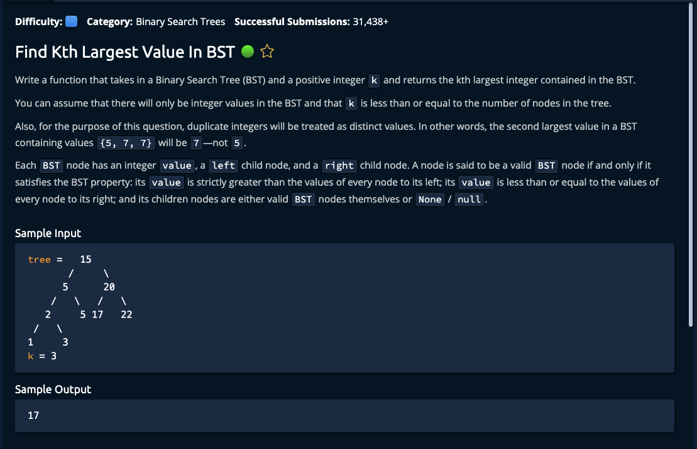

# Find Kth Largest Value In BST



## Solution

```javascript
function findKthLargestValueInBst(tree, k) {
  let res = reverseInOrderTraverse(tree, k);
  return res.pop();
}

function reverseInOrderTraverse(node, k, result = []) {
  if (!node) {
    return result;
  }

  reverseInOrderTraverse(node.right, k, result);

  if (result.length < k) {
    result.push(node.value);
  }

  reverseInOrderTraverse(node.left, k, result);

  return result;
}
```
