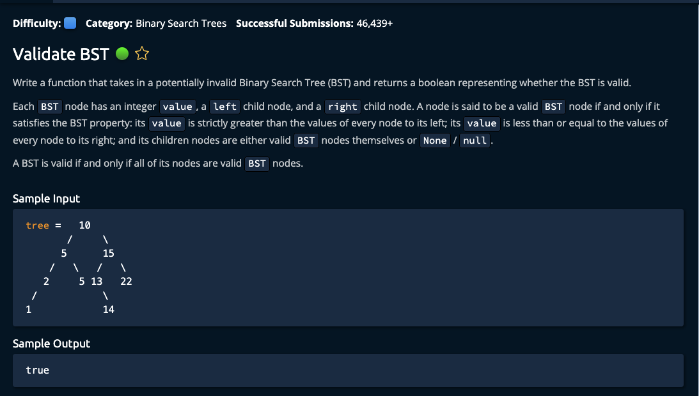

# Validate BST



## Solution

```javascript
// This is an input class. Do not edit.
class BST {
  constructor(value) {
    this.value = value;
    this.left = null;
    this.right = null;
  }
}

function validateBst(tree) {
  if (tree === null) {
    return true;
  }

  return validNode(tree, -Infinity, Infinity);
}

function validNode(node, minVal, maxVal) {
  if (!node) {
    return true;
  }

  if (node.value < minVal || node.value >= maxVal) {
    return false;
  }

  let left = validNode(node.left, minVal, node.value)
  let right = validNode(node.right, node.value, maxVal)

  return left && right;
}

// Do not edit the line below.
exports.BST = BST;
exports.validateBst = validateBst;
```
