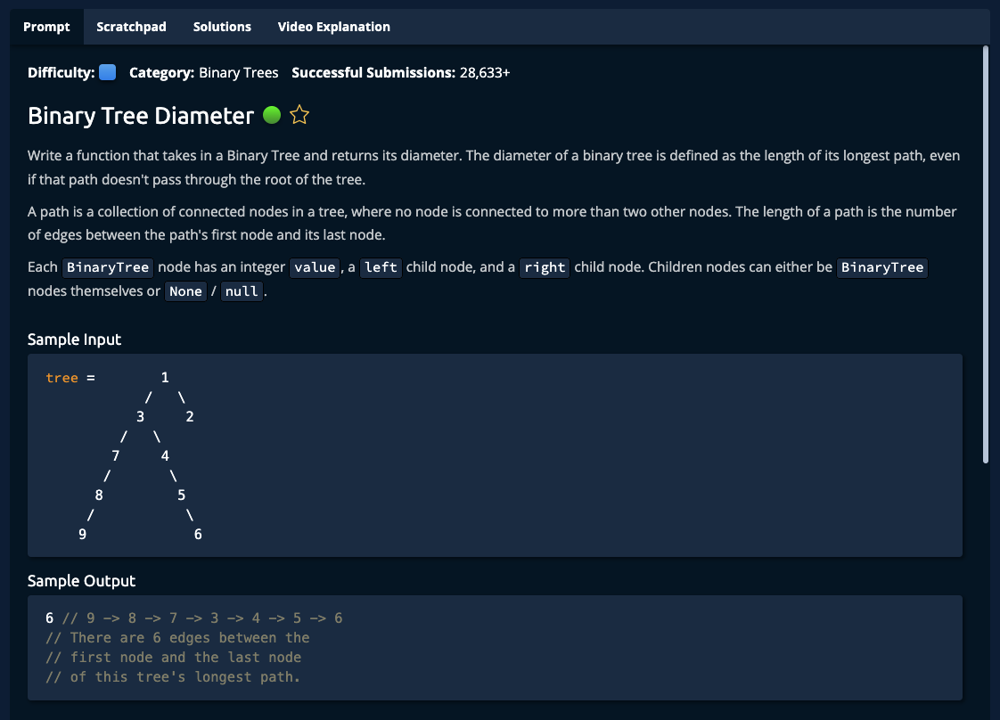

# Binary Tree Diameter



## Solution

```javascript
function binaryTreeDiameter(tree) {
  return getDiameter(tree).diameter;
}

function getDiameter(tree) {
  if (tree === null) {
    return new BinaryTreeInfo(0, 0);
  }

  let dLeft = getDiameter(tree.left);
  let dRight = getDiameter(tree.right);
  let height = 1 + Math.max(dLeft.height, dRight.height);
  let diameter = dLeft.height + dRight.height;
  let maxDiameter = Math.max(diameter, dLeft.diameter, dRight.diameter);

  return new BinaryTreeInfo(height, maxDiameter);
}

// This is an input class. Do not edit.
class BinaryTree {
  constructor(value) {
    this.value = value;
    this.left = null;
    this.right = null;
  }
}

class BinaryTreeInfo {
  constructor(height, diameter) {
    this.height = height;
    this.diameter = diameter;
  }
}

// Do not edit the lines below.
exports.BinaryTree = BinaryTree;
exports.binaryTreeDiameter = binaryTreeDiameter;
```
