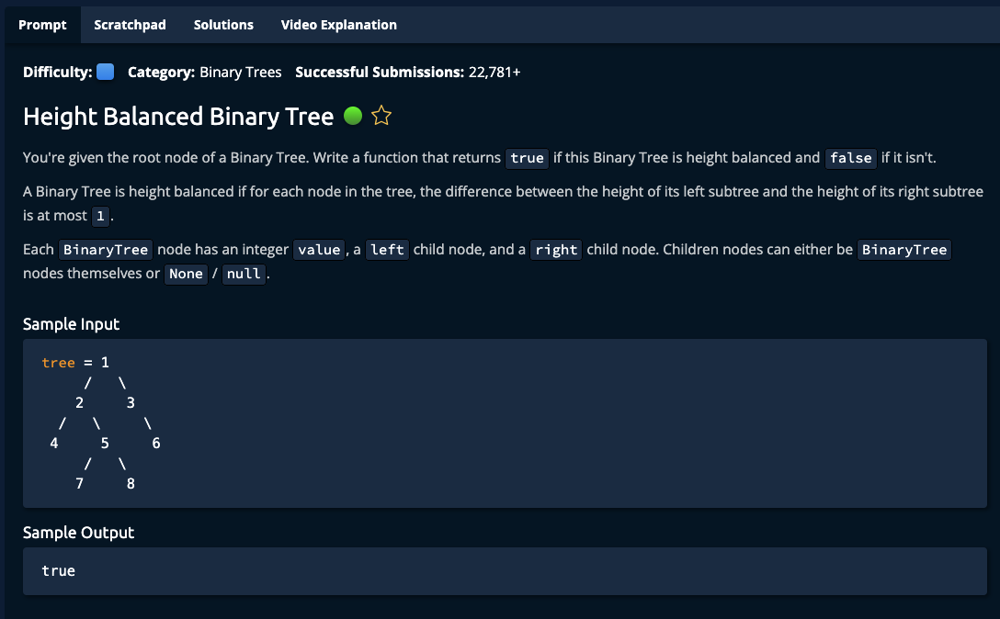

# Height Balanced Binary Tree



## Solution

```javascript
function heightBalancedBinaryTree(tree) {
  return height(tree).isBalanced;
}

function height(node) {
  if (node === null) {
    return new BinaryTreeInfo(0, true);
  }

  let lHeight = height(node.left);
  let rHeight = height(node.right);
  let nodeHeight = 1 + Math.max(lHeight.height, rHeight.height);
  let nodeBalanced = Math.abs(lHeight.height - rHeight.height) <= 1 &&
                     lHeight.isBalanced &&
                     rHeight.isBalanced;

  return new BinaryTreeInfo(nodeHeight, nodeBalanced);
}

class BinaryTreeInfo {
  constructor(height, isBalanced) {
    this.height = height;
    this.isBalanced = isBalanced;
  }
}
```
