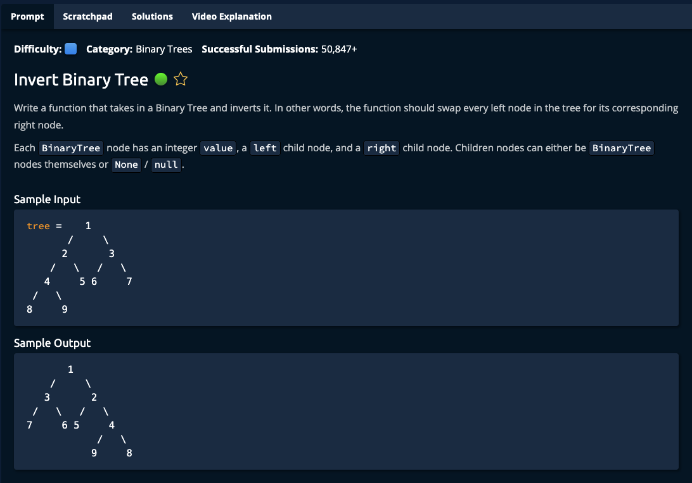

# Invert Binary Tree



## Solution

```javascript
function invertBinaryTree(tree) {
  swap(tree);
}

function swap(node) {
  if (node === null) {
    return;
  }

  let l = node.left;
  let r = node.right;

  node.left = r;
  node.right = l;

  swap(node.left);
  swap(node.right);
}

// This is the class of the input binary tree.
class BinaryTree {
  constructor(value) {
    this.value = value;
    this.left = null;
    this.right = null;
  }
}

// Do not edit the line below.
exports.invertBinaryTree = invertBinaryTree;
```
