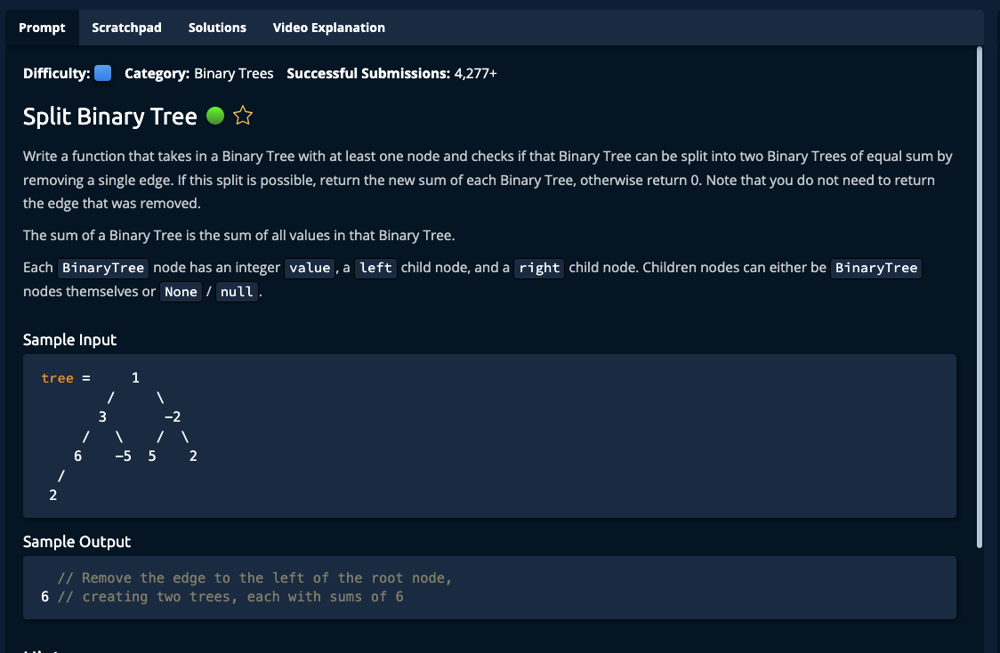

# Split Binary Tree



## Solution

```javascript
function splitBinaryTree(tree) {
  let total = sum(tree);
  let splitVal = total / 2;

  if (total % 2 !== 0) {
    return 0;
  }

  let result = { found: false };
  splitSum(tree, splitVal, result)

  return result["found"] === true ? splitVal : 0;
}

function splitSum(tree, splitVal, result) {
  if (!tree) {
    return 0;
  }

  let leftSum = splitSum(tree.left, splitVal, result);
  let rightSum = splitSum(tree.right, splitVal, result);
  let curr = tree.value + leftSum + rightSum;

  if (curr === splitVal) {
    result["found"] = true;
  }

  return curr;
}

function sum(tree) {
  if (!tree) {
    return 0;
  }

  return tree.value + sum(tree.left) + sum(tree.right);
}
```
