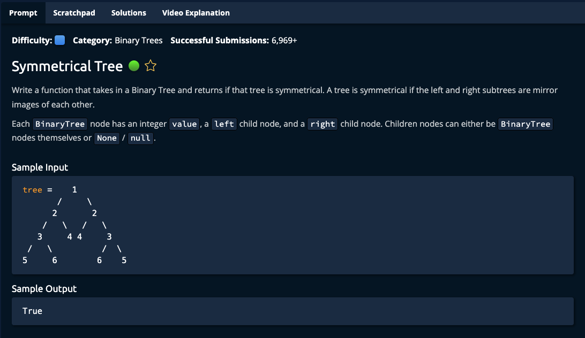

# Symmetrical Tree



## Solution

```javascript
function symmetricalTreeV1(tree) {
  let left = tree.left;
  let right = tree.right;

  return symmetrical(left, right);
}

function symmetrical(tree1, tree2) {
  if (!tree1 || !tree2) {
    return tree1 === tree2;
  }

  if (tree1.value === tree2.value) {
    return symmetrical(tree1.left, tree2.right) &&
           symmetrical(tree1.right, tree2.left);
  }

  return false;
}

function symmetricalTreeV2(tree) {
  let queue = [[tree.left, tree.right]];

  while (queue.length > 0) {
    let [left, right] = queue.shift();
    if (!left && !right) {
      continue;
    }

    let node1 = left ? left.value : null;
    let node2 = right ? right.value : null;
    if (node1 !== node2) {
      return false;
    }

    queue.push([
      left ? left.left : null,
      right ? right.right : null,
    ]);

    queue.push([
      left ? left.right : null,
      right ? right.left : null,
    ]);
  }

  return true;
}
```
