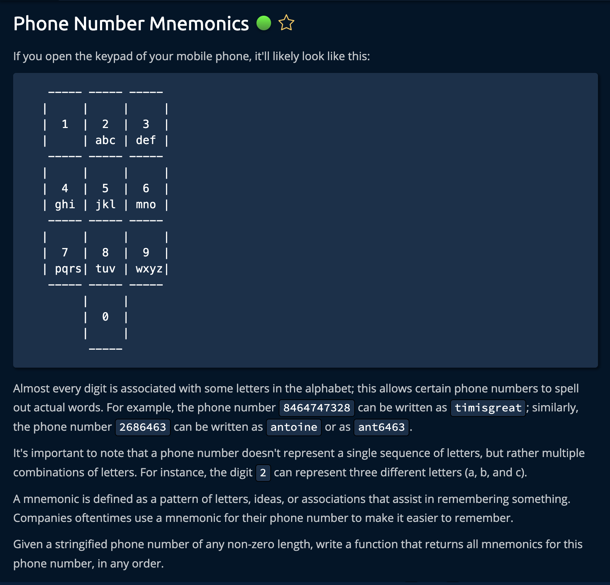

# Phone Number Mnemonics



## Solution

```javascript
const NUMBER_TO_LETTERS = {
  "1": ['1'],
  "2": ['a','b','c'],
  "3": ['d','e','f'],
  "4": ['g','h','i'],
  "5": ['j','k','l'],
  "6": ['m','n','o'],
  "7": ['p','q','r', 's'],
  "8": ['t','u', 'v'],
  "9": ['w','x','y', 'z'],
  "0": ['0']
}

function phoneNumberMnemonics(phoneNumber) {
  let mnemonics = []
  getMnemonics(phoneNumber, 0, [], mnemonics);

  return mnemonics;
}

function getMnemonics(phoneNumber, idx, cMnemonic, mnemonics) {
  if (idx === phoneNumber.length) {
    mnemonics.push(cMnemonic.join(""));
    return;
  }

  const digit = phoneNumber[idx];
  const letters = NUMBER_TO_LETTERS[digit];

  for (let letter of letters) {
    const curr = [...cMnemonic, letter];
    getMnemonics(phoneNumber, idx + 1, curr, mnemonics);
  }
}

// Do not edit the line below.
exports.phoneNumberMnemonics = phoneNumberMnemonics;
```
