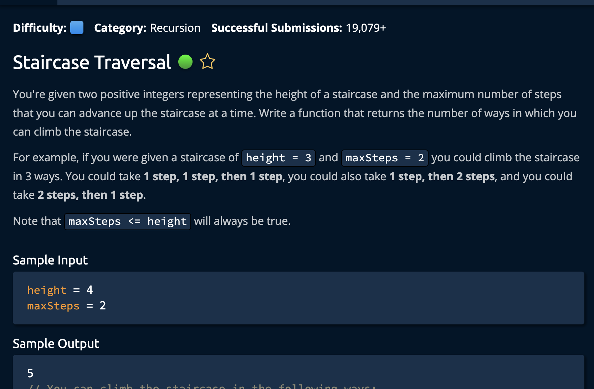

# Staircase Traversal



## Solution

```javascript
function staircaseTraversal(height, maxSteps) {
  const memo = {};
  return getStaircaseTraversal(height, maxSteps, memo);
}

function getStaircaseTraversal(height, maxSteps, memo) {
  if (height in memo) {
    return memo[height];
  }

  if (height === 0) {
    return 1;
  }

  if (height < 0) {
    return 0;
  }

  let totalWays = 0;
  for (let step = 1; step <= maxSteps; step++) {
    totalWays += getStaircaseTraversal(height - step, maxSteps, memo);
  }

  memo[height] = totalWays;
  return totalWays;
}

// Do not edit the line below.
exports.staircaseTraversal = staircaseTraversal
```
