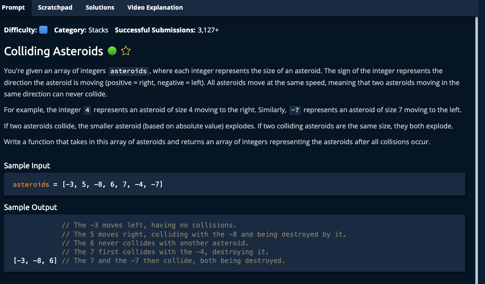

# Colliding Asteroids



## Solution

```javascript
function collidingAsteroids(asteroids) {
  let surv = [];

  for (let ast of asteroids) {
    while (true) {
      let lastSurv = surv.length - 1;
      if (surv.length === 0 || surv[lastSurv] < 0) {
        surv.push(ast);
        break;
      }

      if (ast > 0 && surv[lastSurv] > 0) {
        surv.push(ast);
        break;
      }

      if (Math.abs(ast) < Math.abs(surv[lastSurv])) {
        break;
      }

      if (Math.abs(ast) === Math.abs(surv[lastSurv])) {
        surv.pop();
        break;
        }

      surv.pop();
    }
  }

  return surv;
}

// Do not edit the line below.
exports.collidingAsteroids = collidingAsteroids;
```
