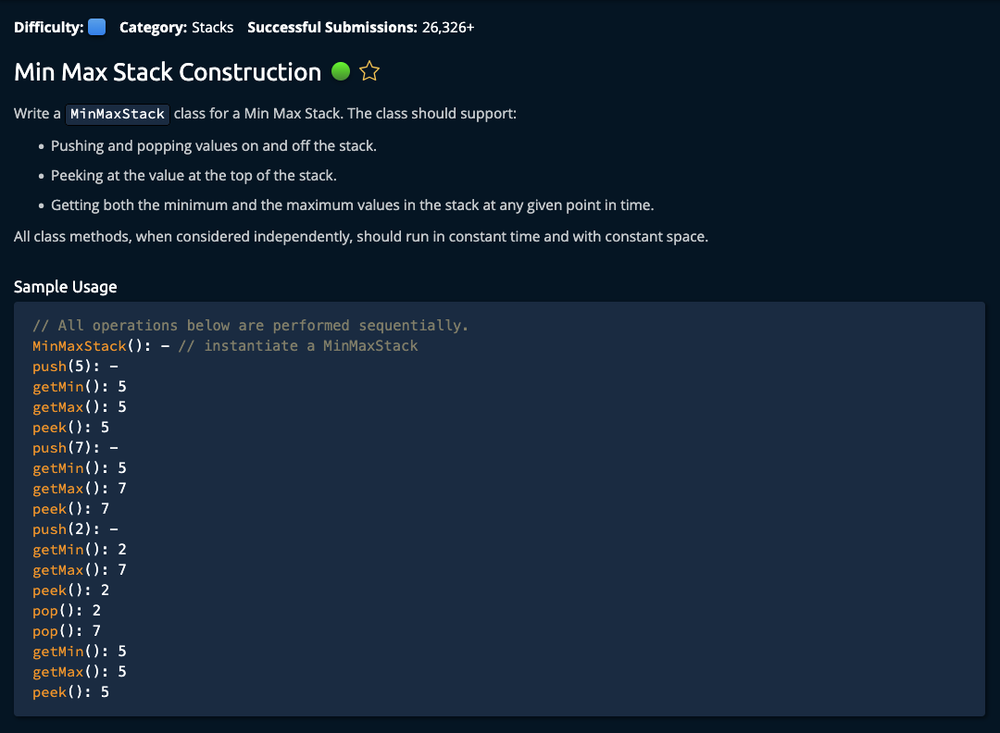

# Min Max Stack Construction



## Solution

```javascript
// Feel free to add new properties and methods to the class.
class MinMaxStack {
  constructor() {
    this.stack = [];
    this.minMaxStack = [];
  }

  peek() {
    return this.stack[this.stack.length - 1];
  }

  pop() {
    this.minMaxStack.pop();
    return this.stack.pop();
  }

  push(number) {
    let minMax = this.minMaxStack[this.minMaxStack.length - 1] || [Infinity, -Infinity];
    let min = Math.min(minMax[0], number);
    let max = Math.max(minMax[1], number);

    this.minMaxStack.push([min,max]);
    this.stack.push(number);
  }

  getMin() {
    let minMax = this.minMaxStack[this.minMaxStack.length - 1];
    return minMax[0];
  }

  getMax() {
    let minMax = this.minMaxStack[this.minMaxStack.length - 1];
    return minMax[1];
  }
}

// Do not edit the line below.
exports.MinMaxStack = MinMaxStack;
```
