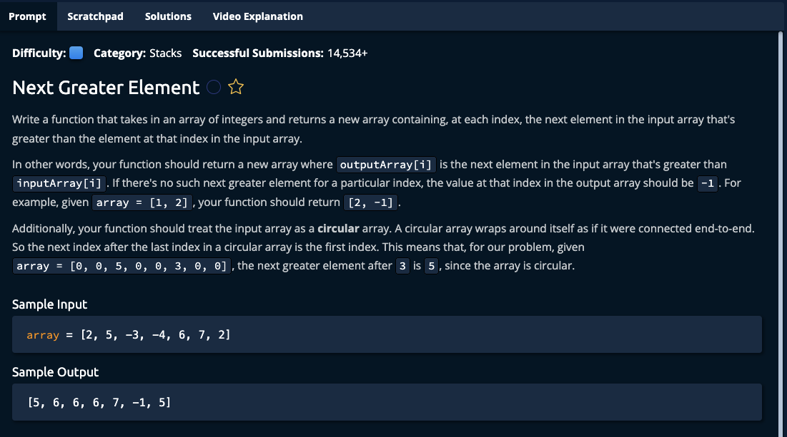

# Next Greater Element



## Solution

```javascript
function nextGreaterElement(array) {
  let stack = [];
  let result = new Array(array.length).fill(-1);

  for (let i = 2 * array.length - 1; i >= 0; i--) {
    let idx = i % array.length;
    let curr = array[idx];

    while (stack.length > 0) {
      if (curr >= stack[stack.length - 1]) {
        stack.pop();
      } else {
        result[idx] = stack[stack.length - 1];
        break;
      }
    }

    stack.push(curr);
  }

  return result;
}

// Do not edit the line below.
exports.nextGreaterElement = nextGreaterElement;
```
