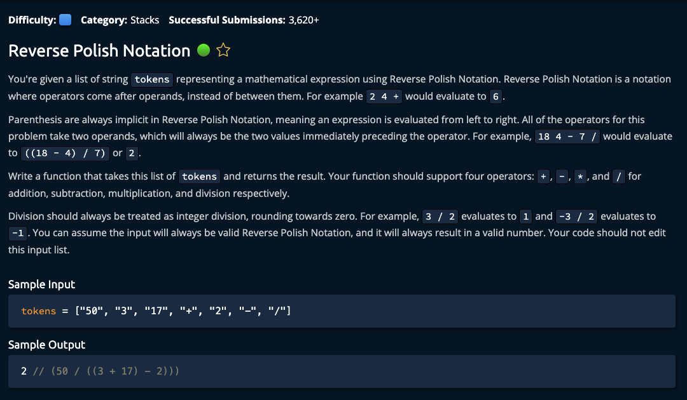

# Reverse Polish Notation



## Solution

```javascript
function reversePolishNotation(tokens) {
  let stack = [];

  // We need at least 3 items
  if (tokens.length < 3) {
    return Number(tokens.pop());
  }

  for (let token of tokens) {
    if (["+", "-", "/", "*"].includes(token)) {
      let numberB = Number(stack.pop());
      let numberA = Number(stack.pop());

      let opRes = doOperation(numberA, numberB, token);
      stack.push(opRes);
    } else {
      stack.push(token);
    }
  }

  return stack.pop();
}

function doOperation(numberA, numberB, operand) {
  switch(operand) {
    case "+":
      return numberA + numberB;
    case "-":
      return numberA - numberB;
    case "*":
      return numberA * numberB;
    case "/":
      return Math.trunc(numberA / numberB);
  }
}

// Do not edit the line below.
exports.reversePolishNotation = reversePolishNotation;
```
