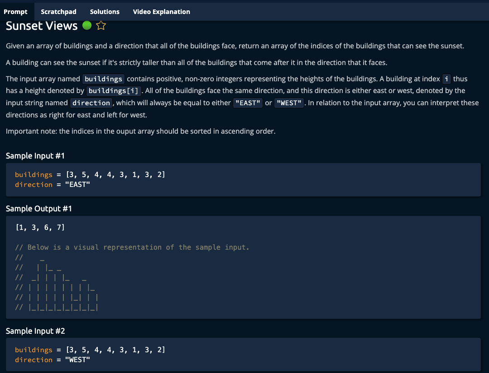

# Sunset Views



## Solution

```javascript
// Solution 1
// Step one -> Create a stack
// Step two -> Iterate through the direction
// Step three -> iterate to remove smaller or equals
// Step four -> add to stack
// Step five -> reverse the result
function sunsetViewsV1(buildings, direction) {
  let sunsetViews = [];
  let idx = direction === 'EAST' ? 0 : buildings.length - 1;
  let step = direction === 'EAST' ? 1 : -1;

  while (idx >= 0 && idx < buildings.length) {
    let building = buildings[idx];
    while (sunsetViews.length > 0 && building >= buildings[sunsetViews[sunsetViews.length - 1]]) {
      sunsetViews.pop();
    }

    sunsetViews.push(idx);
    idx = idx + step;
  }

  if (direction === 'WEST') {
    sunsetViews.reverse();
  }

  return sunsetViews;
}

// Solution 2
// Step one -> Iterate the opposite direction
// Step two -> save the current max
// Step three -> if curr > tallest, then add it
// Step four -> reverse the result
function sunsetViewsV2(buildings, direction) {
  let sunsetViews = [];
  let idx = direction === 'EAST' ? buildings.length - 1 : 0;
  let step = direction === 'EAST' ? -1 : 1;
  let tallest = -Infinity;

  while (idx >= 0 && idx < buildings.length) {
    let building = buildings[idx];

    if (building > tallest) {
      sunsetViews.push(idx);
      tallest = building;
    }

    idx = idx + step;
  }

  if (direction === 'EAST') {
    sunsetViews.reverse();
  }

  return sunsetViews;
}

// Do not edit the line below.
exports.sunsetViewsV1 = sunsetViewsV1;
exports.sunsetViewsV2 = sunsetViewsV2;
```
